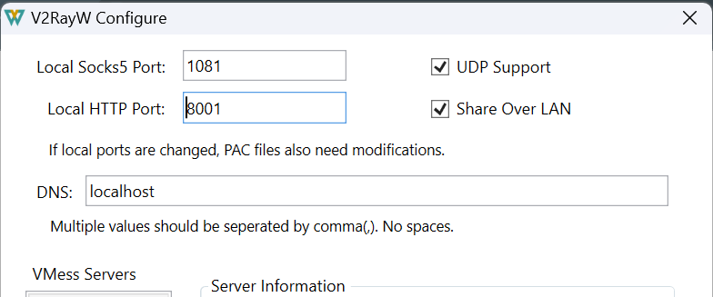
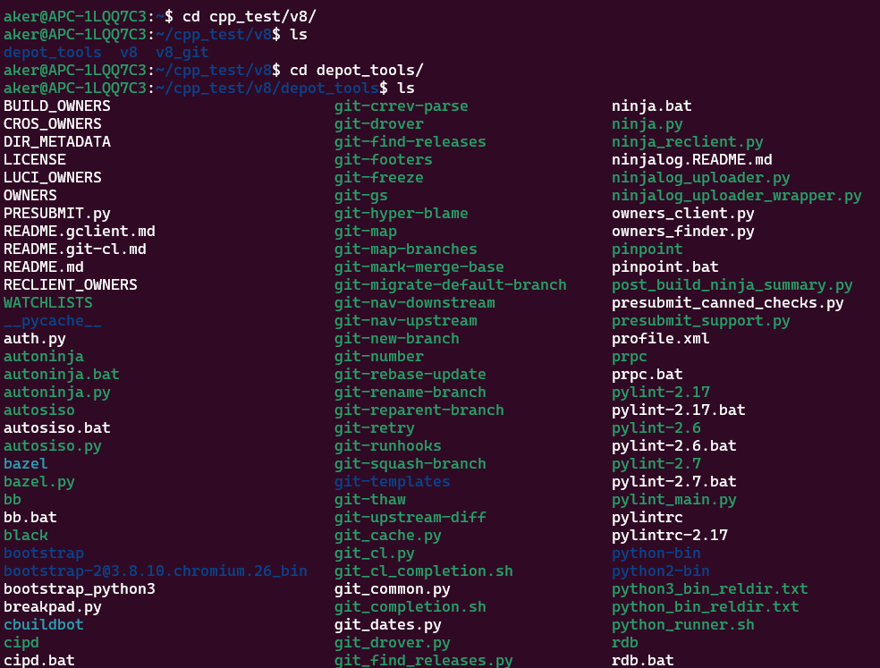
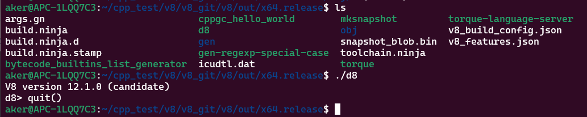
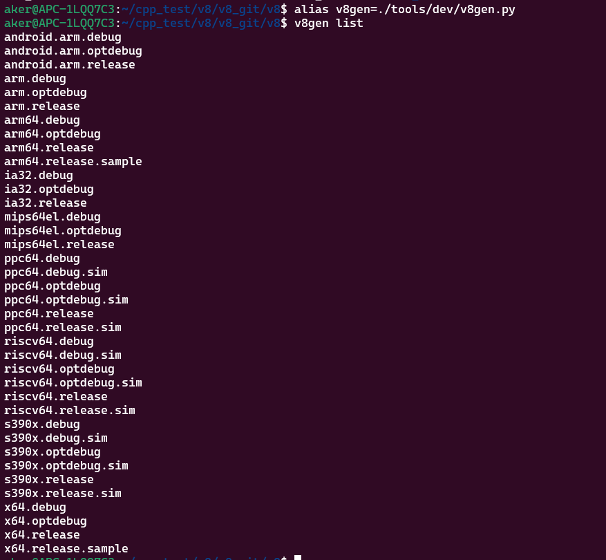
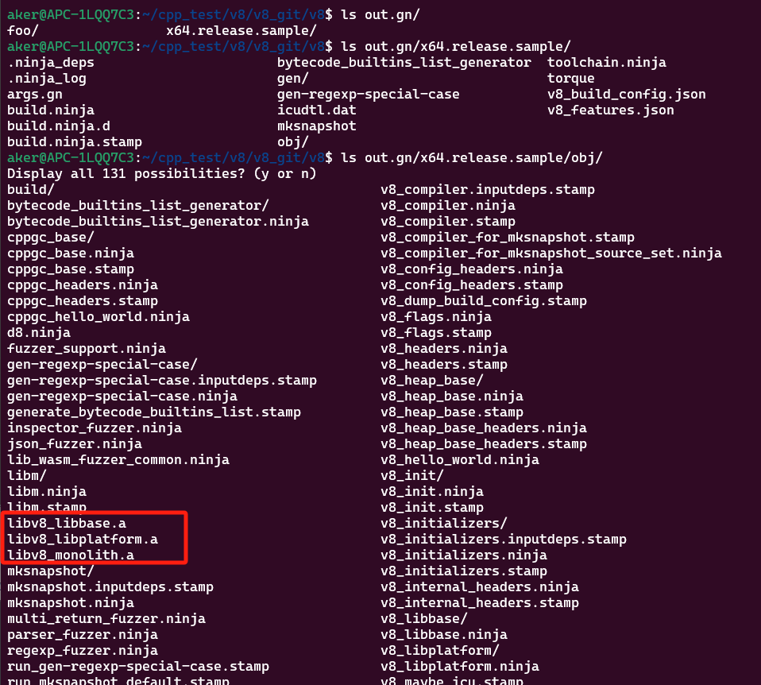
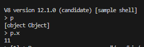
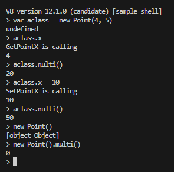

# 集成V8

V8是C++库，用于解析JavaScript 脚本。宏观来看，他的原理部分可以通过学习[C++ lispy](https://github.com/akerdi/lval) / [JavaScript lispy](https://github.com/akerdi/jslispy)，其内部会对Ast之后的代码生成字节码，部分优化后生成机器码，这部分知识待日后分解源码。本文讲解学习V8 过程。

## 1.环境

```
Platform: VSCode(Windows) + WSL(Ubuntu)
Language: C++
```

## 2.编译V8

首先从V8 官网查看[编译文档](https://v8.dev/docs/build), 他要求下载相关工具: Follow the instructions in our guide on [checking out the V8 source code](https://v8.dev/docs/source-code).

### 2.1下载depot_tools

首先下载depot_tools:

    git clone https://chromium.googlesource.com/chromium/tools/depot_tools.git

将depot_tools 作为工具目录:

    export PATH=/path/to/depot_tools:$PATH

对于我，我将其放到了 /home/aker/cpp_test/v8/depot_tools, 所以我的语句是: `export PATH=/home/aker/cpp_test/v8/depot_tools:$PATH`.

关于gclient 工具需要科学上网获取相关工具的问题，可以[参考这篇文章](https://zinglix.xyz/2020/04/18/wsl2-proxy/), 只为了学习为目的哈。

我这里的做法是: 首先使用curl https://google.com 是能联网的，然后gclient 调用时就发生错误。这时设置git:

    git config --global http.proxy $IP:8001
    git config --global https.proxy $IP:8001

这里的$IP 值是: `cat /etc/resolv.conf` 中的namespace 项目。(注意http 和socks5 端口对应, 我这里的VPN设置http端口为8001)

以上是设置git 的信息，而如果是设置整个wsl terminal 的联网，则设置:

    export http_proxy=$IP:8001
    export https_proxy=$IP:8001

> 如果没有科学上网工具，则可以使用[站长之家网站](https://tool.chinaz.com/dns/chromium.googlesource.com) 或者其他域名找IP的方案，得到域名。然后如 `echo "108.177.97.82 chromium.googlesource.com" >> /etc/hosts` 来强制修改可打开的网站。

> 设置Ubuntu - WSL 使用Windows 的V2rayx 来proxy 请求，发现总是失败，报网络问题。\
  `$curl https://news.ycombinator.com -v` 显示确实转向Windows 的v2rayx. 再测试Windows 的python3 -m http.server 然后`$telnet $IP 8000` 能联通说明双方都没问题。\
  设置防火墙去Allow app，类似上面的参考文章设置防火墙规则，设置后还是失败。\
  此时打开V2rayx - Configure 将 UDP Support 和Share Over Lan 打开后最终链接成功。如下图:

> 如果觉得apt 下载太慢？可以复用VPN 复用方法[如链接](https://github.com/microsoft/WSL/issues/1570#issuecomment-271531911)



接下来下载相关工具, 先执行: `$gclient`.(不带参数，该步骤更新depot_tool 工具)

gclient 完成如图:



### 2.2获取源码

    mkdir v8 && cd v8
    fetch v8 // 如果遇到错，则直接执行 gclient sync 即可

想要对应版本时可以进行切换:

    git branch -a && git checkout -b branch-heads/12.0 remotes/origin/12.0

安装构建依赖项(linux 系统需要，只需要执行一次):

    ./build/install-build-deps.sh

### 2.3编译d8

d8 是V8引擎用于展示V8功能的executable app，编译他是为了尝试功能是否得以验证，并体验Javascript引擎:

    tools/dev/gm.py x64.release

编译时间很长，如果想直接集成V8，则跳过此章节。

完成后可以查看体验d8:



### 2.4编译静态库

查看可以指定编译的平台:

    alias v8gen=./tools/dev/v8gen.py
    v8gen list



生成目标平台必须的构建文件(Generate the necessary build files by executing the following in your terminal/shell):

    v8gen x64.release

编译x64.release 架构，则执行:

    ninja -C out.gn/x64.release

由于我们是要开发测试，并且使用libv8_monolith, 那么执行:

    v8gen x64.release.sample
    ninja -C out.gn/x64.release.sample v8_monolith

这个x64.release.sample 正是 `v8gen list` 列出的其中一个平台.

最终结果在:



## 3.集成

这里展示CMake 集成过程:

CMakeLists.txt
```
cmake_minimum_required(VERSION 3.2)

set(CMAKE_CXX_STANDARD 17)

project(app)

# -DV8_COMPRESS_POINTERS -DV8_ENABLE_SANDBOX
# 解决编译时报错: `Embedder-vs-V8 build configuration mismatch.`
set(CMAKE_CXX_FLAGS "${CMAKE_CXX_FLAGS} -DV8_COMPRESS_POINTERS -DV8_ENABLE_SANDBOX")

set(SOURCE_FILES ./main.cpp)

add_executable(app ${SOURCE_FILES})

# 加载静态库
target_include_directories(app PUBLIC /home/aker/cpp_test/v8/v8_git/v8/include)
target_link_directories(app PUBLIC /home/aker/cpp_test/v8/v8_git/v8/out.gn/x64.release.sample/obj)
target_link_libraries(app -lpthread -lv8_monolith -lv8_libbase -lv8_libplatform)
```

重点是指定将头文件和静态库加入到项目中。(项目外可能导致编译问题)。

> 这里特别说明，编译并link时需要附带 `-ldl` 库, 此库在第二次换新电脑编译时报错缺少这个库，并且需要附加`CMAKE_CXX_FLAGS` 一个新的options `-Wl,--no-as-needed`，如下边修改:

```diff
-set(CMAKE_CXX_FLAGS "${CMAKE_CXX_FLAGS} -DV8_COMPRESS_POINTERS -DV8_ENABLE_SANDBOX")
+set(CMAKE_CXX_FLAGS "${CMAKE_CXX_FLAGS} -DV8_COMPRESS_POINTERS -DV8_ENABLE_SANDBOX -Wl,--no-as-needed")
-target_link_libraries(app -lpthread -lv8_monolith -lv8_libbase -lv8_libplatform)
+target_link_libraries(app -ldl -lpthread -lv8_monolith -lv8_libbase -lv8_libplatform)
```

> 另外需要编译Release 库时，操作为在terminal 中执行 `./build.sh Release`. 按F5进行debug 执行的是 `./build.sh Debug`, 也可以更换launch.json - preLaunchTask 的值"build_standalone" 为 "CMake Build", 功能完全一样(参考.vscode/launch.example.json)。

## 4.测试

测试使用V8自带的3个例子: /samples/[hello-world.cc|shell.cc|process.cc].

> 直接使用main.cpp 作为测试时，其为tech/6.3processon_process.cpp 的例子，需要提供输入js文件。此时运行 ./app count-hosts.js， 或者在VSCode 编辑其中Debug，按F5启动，参数args在.vscode/launch.json 的args 中解开注释"count-hosts.js".

## 5.学习使用

刚开始入门学习hello-world.cc 的例子，他指导如何V8使用的流程。

当大致能默写hello-world.cc(了解下大致流程，并且能手写默写)，就可以开始真正的学习了。

### 5.1.了解基础

+ An isolate is a VM instance with its own heap.
    - 一个isolate就是VM实例，他有独立的堆数据。
+ A local handle is a pointer to an object. All V8 objects are accessed using handles. They are necessary because of the way the V8 garbage collector works.
    - 一个local handle 代表一个对象包含着一个指针。所有V8对象都通过handle来获取。这是非常有必要的，因为这样数据就可以使用V8的资源(不可用)回收工作。
+ A handle scope can be thought of as a container for any number of handles. When you've finished with your handles, instead of deleting each one individually you can simply delete their scope.
    - 一个handle scope可以把他想象成一个容器包含着很多的handles。当你结束你对这些数据的操作时，你可以简单的删除这个scope而一起把附属的handle资源都回收，而不用一个一个的操作删除。
+ A context is an execution environment that allows separate, unrelated, JavaScript code to run in a single instance of V8. You must explicitly specify the context in which you want any JavaScript code to be run.
    - 一个context(上下文)形成一个可执行的环境，他允许分割和不相关联，JavaScript 代码运行再一个V8实例。你必须精确指定一个context去执行JavaScript代码。

### 5.2.CPP2JS映射对象

首先提供一个HelloWorld 执行Script的环境，或者启动Shell的示例。我们这里采用启动Shell的示例，版本是12.0.0:

```cpp
#include "include/libplatform/libplatform.h"
#include "include/v8.h"
using namespace v8;

Local<ObjectTemplate> initializeGlobal(Isolate* isolate) {
  EscapableHandleScope handle_scope(isolate);
  Local<ObjectTemplate> global = ObjectTemplate::New(isolate);
  return handle_scope.Escape(global);
}
Local<Context> CreateShellContext(Isolate* isolate, Local<ObjectTemplate> global) {
  return Context::New(isolate, NULL, global);
}

int main(int argc, char* argv[]) {
  V8::InitializeICUDefaultLocation(argv[0]);
  V8::InitializeExternalStartupData(argv[0]);
  std::unique_ptr<Platform> platform = platform::NewDefaultPlatform();
  V8::InitializePlatform(platform.get());
  V8::Initialize();

  Isolate::CreateParams create_params;
  create_params.array_buffer_allocator = ArrayBuffer::Allocator::NewDefaultAllocator();
  Isolate* isolate = Isolate::New(create_params);
  {
    // 设定Isolate 和Handle的上下文scope
    Isolate::Scope isolate_scope(isolate);
    HandleScope handle_scope(isolate);

    // 生成global的ObjectTemplate
    Local<ObjectTemplate> global = initializeGlobal(isolate);
    // 生成context
    Local<Context> context(CreateShellContext(isolate, global));
    // 设定当前context上下文scope
    Context::Scope context_scope(context);
    RunShell(isolate, platform.get());
  }
  isolate->Dispose();
  V8::Dispose();
  V8::DisposePlatform();
  delete create_params.array_buffer_allocator;
  return 0;
}
```

上面示例中缺少RunShell方法的实现，其他代码就是V8运行模板。如果要运行一个简单Shell，则可以实现:

```cpp
void RunShell(Isolate* isolate, Platform* platform) {
  // 通过isolate获取上下文context
  Local<Context> context = isolate->GetCurrentContext();

  Local<String> source;
  if (!String::NewFromUtf8(isolate, "1+3").ToLocal(&source)) {
    exit(1);
  }
  // 通过在当前context上下文环境编译字符串，然后在当前context中运行
  Local<Script> script = Script::Compile(context, source).ToLocalChecked();
  // Local对象重写了operate-> 方法，其中包括各个类型的转换方法，最后ToChecked即可转换成功
  Local<Value> result = script->Run(context).ToLocalChecked();
  int32_t a = result->Int32Value(context).ToChecked();
  printf("result is %d\n", a);
}
```

以上是直接编译一个JS执行字符串的例子，[完整在代码](./tech/1.helloworld.cpp).

而如果要形成REPL(Read/Eval/Print/Loop), 则可以通过下方示例，替换RunShell方法即可实现:

```cpp
const char* ToCString(const String::Utf8Value& value) {
  return *value ? *value : "<string conversion failed>";
}
bool ExecuteString(Isolate* isolate, Local<String> source, Local<Value> name) {
  HandleScope handle_scope(isolate);
  Local<Context> context(isolate->GetCurrentContext());
  ScriptOrigin origin(name);
  Local<Script> script;
  if (!Script::Compile(context, source, &origin).ToLocal(&script)) {
    return false;
  }
  Local<Value> result;
  if (!script->Run(context).ToLocal(&result)) {
    return false;
  }
  String::Utf8Value str_value(isolate, result);
  const char* str = ToCString(str_value);
  printf("%s\n", str);
}
void RunShell(Isolate* isolate, Platform* platform) {
  fprintf(stdout, "V8 version %s [sample shell]\n", V8::GetVersion());
  Local<Context> context(isolate->GetCurrentContext());
  Context::Scope context_scope(context);

  static const int kBufferSize = 256;
  Local<String> name(String::NewFromUtf8Literal(isolate, "(shell)"));
  while (true) {
    char buffer[kBufferSize];
    fprintf(stdout, "> ");
    char* str = fgets(buffer,  kBufferSize, stdin);
    if (str == NULL) break;
    HandleScope handle_scope(isolate);
    ExecuteString(isolate, String::NewFromUtf8(isolate, str).ToLocalChecked(), name);
    // v8::platform::PumpMessageLoop 是V8引擎得平台类中得一个方法。它用于在V8引擎得消息循环中处理待处理得消息。
    // V8引擎得消息循环是一个事件处理机制，用于处理异步操作和事件驱动的任务。通常情况下，PumpMessageLoop方法会在V8引擎的主线程中被调用，用于保持消息循环的运行。
    while (platform::PumpMessageLoop(platform, isolate))
      continue;
  }
  fprintf(stdout, "\n");
}
```

以上即可以运行Shell了: [shell](./tech/2.shell.cpp)。接下来我们映射JS映射对象:

```diff
+int x;
+void XGetter(Local<String> property, const PropertyCallbackInfo<Value>& info) {
+   info.GetReturnValue().Set(x);
+}
+void XSetter(Local<String> property, Local<Value> value, const PropertyCallbackInfo<void>& info) {
+   x = value->Int32Value(info.GetIsolate()->GetCurrentContext()).FromMaybe(0);
+}
Local<ObjectTemplate> initializeGlobal(Isolate* isolate) {
    EscapableHandleScope handle_scope(isolate);
    Local<ObjectTemplate> global = ObjectTemplate::New(isolate);
+   global->SetAccessor(String::NewFromUtf8(isolate, "x").ToLocalChecked(), XGetter, XSetter);
    return handle_scope.Escape(global);
}
```

要指定全局参数x给到JS调用.

测试: 运行Shell后，查看`x` 不是undefined，则代表映射成功.

[shell_x](./tech/3.shell_x.cpp)

### 5.3.CPP2JS映射全局对象

映射全局对象，我们假设生成了一个Point对象，最终将该对象暴露到JS中:

```diff
+class Point {
+public:
+  Point(int x): x_(x) {}
+  int x_;
+};
+void GetPointX(Local<String> property, const PropertyCallbackInfo<Value>& info) {
+  Local<Object> self = info.Holder();
+  Local<External> wrap = Local<External>::Cast(self->GetInternalField(0));
+  void* ptr = wrap->Value();
+  int value = static_cast<Point*>(ptr)->x_;
+  info.GetReturnValue().Set(value);
+}
+void SetPointX(Local<String> property, Local<Value> value, const PropertyCallbackInfo<void>& info) {
+  Local<Object> self = info.Holder();
+  Local<External> wrap = Local<External>::Cast(self->GetInternalField(0));
+  void* ptr = wrap->Value();
+  static_cast<Point*>(ptr)->x_ = value->Int32Value(info.GetIsolate()->GetCurrentContext()).ToChecked();
+}
+void localGenerateX(Isolate* isolate) {
+  Local<Context> context(isolate->GetCurrentContext());
+
+  Local<ObjectTemplate> result = ObjectTemplate::New(isolate);
+  result->SetInternalFieldCount(1);
+  result->SetAccessor(String::NewFromUtf8(isolate, "x").ToLocalChecked(), GetPointX, SetPointX);
+  Point* p = new Point(11);
+  Local<Object> obj = result->NewInstance(context).ToLocalChecked();
+  obj->SetInternalField(0, External::New(isolate, p));
+  context->Global()->Set(context, String::NewFromUtf8(isolate, "p").ToLocalChecked(), obj).ToChecked();
+}
int main(int argc, char* argv[]) {
  ...
  {
    Isolate::Scope isolate_scope(isolate);
    HandleScope handle_scope(isolate);

    Local<ObjectTemplate> global = initializeGlobal(isolate);
    Local<Context> context(CreateShellContext(isolate, global));
    Context::Scope context_scope(context);
+    localGenerateX(isolate);
    RunShell(isolate, platform.get());
  }
}
```

通过向context->Global()->Set 设置了键`p`, 值为Local<ObjectTemplate> result 的NewInstance 对象。这样就将p 对象绑定到了JS对象中。

> External 是什么类型？答: void*，通过取名External 知晓是无类型指针。

测试: 启动后测试 p 和 p.x:



### 5.4.CPP2JS映射Class

映射Class 和上篇[#5.3映射全局对象](#53cpp2js映射全局对象) 基本一样。不同之处: 1. 对象映射可以在任何时刻，类型只能在global创建时处理；2. 对象映射生成的是ObjectTemplate, 类型是FunctionTemplate, 并且提供方法创建回调的方式来约定创建细节；等等...

```diff
+class Point {
+public:
+  Point(int x, int y): x_(x), y_(y) {}
+  int multi() {
+    return x_ * y_;
+  }
+
+  int x_, y_;
+};
+void GetPointX(Local<String> property, const PropertyCallbackInfo<Value>& info) {
+  printf("GetPointX is calling\n");
+  // 为什么使用info.This()?
+  // https://stackoverflow.com/a/34257459
+  Local<Object> self = info.This();
+  Local<External> wrap = Local<External>::Cast(self->GetInternalField(0));
+  void* ptr = wrap->Value();
+  int value = static_cast<Point*>(ptr)->x_;
+  info.GetReturnValue().Set(value);
+}
+void SetPointX(Local<String> property, Local<Value> value, const PropertyCallbackInfo<void>& info) {
+  printf("SetPointX is calling\n");
+  Local<Object> self = info.This();
+  Local<External> wrap = self->GetInternalField(0).As<Value>().As<External>();
+  void* ptr = wrap->Value();
+  static_cast<Point*>(ptr)->x_ = value->Int32Value(info.GetIsolate()->GetCurrentContext()).ToChecked();
+}
+void PointMulti(const FunctionCallbackInfo<Value>& args) {
+  Isolate* isolate = Isolate::GetCurrent();
+  HandleScope handle_scope(isolate);
+
+  Local<Object> self = args.Holder();
+  Local<External> wrap = self->GetInternalField(0).As<Value>().As<External>();
+  void* ptr = wrap->Value();
+  int value = static_cast<Point*>(ptr)->multi();
+  args.GetReturnValue().Set(value);
+}
+void ConstructorCallback(const FunctionCallbackInfo<Value>& args) {
+  auto isolate = args.GetIsolate();
+  Local<Context> context(isolate->GetCurrentContext());
+  double x = args[0]->NumberValue(context).ToChecked();
+  double y = args[1]->NumberValue(context).ToChecked();
+  Local<External> external = External::New(isolate, new Point(x, y));
+  args.This()->SetInternalField(0, external);
+}
+void localNewPoint(Isolate* isolate, Local<ObjectTemplate>& global) {
+  Local<FunctionTemplate> pointTemplate = FunctionTemplate::New(isolate, ConstructorCallback);
+  pointTemplate->InstanceTemplate()->SetInternalFieldCount(1);
+  pointTemplate->SetClassName(String::NewFromUtf8(isolate, "Point", NewStringType::kInternalized).ToLocalChecked());
+  auto prototype_t = pointTemplate->PrototypeTemplate();
+  prototype_t->SetAccessor(String::NewFromUtf8(isolate, "x", NewStringType::kInternalized).ToLocalChecked(), GetPointX, SetPointX);
+  pointTemplate->PrototypeTemplate()->Set(String::NewFromUtf8(isolate, "multi").ToLocalChecked(), FunctionTemplate::New(isolate, PointMulti));
+
+  global->Set(isolate, "Point", pointTemplate);
+}
Local<ObjectTemplate> initializeGlobal(Isolate* isolate) {
  EscapableHandleScope handle_scope(isolate);
  Local<ObjectTemplate> global = ObjectTemplate::New(isolate);

+  localNewPoint(isolate, global);
  return handle_scope.Escape(global);
}
```

以上实现了Class 注册到JS办法。测试:



### 5.5.JS2CPP映射方法

待续...

### 6.ProcessOn

ProcessOn 是v8的第三个Sample(Hello-world / Shell / ProcessOn). ProcessOn 实现ObjectTemplate / FunctionTemplate, 并且最终在执行Js脚本后得到Js的Process方法，并且进行运行。

运行 processon_maptemplate 时，使用脚本map.js:

    ./processon verbose=true map.js

运行 processon_requesttemplate 时，使用脚本count-host.js:

    ./processon verbose=true count-host.js

#### 6.1ProcessOn_MapTemplate

ProcessOn Sample 和之前 Hello World 和 Shell 的Sample 差不多的模板，从 main 开始: -> 读取"环境变量" -> 创建Isolate 及设置Scope(内存回收模块) -> 读取文件内容入 "Local<String> source" -> processor.Initialize(使用maptemplate 生成map，映射到options 和 output) -> PrintMap.

<!-- 首先是`typedef map<string, string> StringStringMap;` StringStringMap  -->
开始的读取文件Readfile:

```cpp
// retrive data by set return param `MaybeLocal<Some type>`
MaybeLocal<String> Readfile(Isolate* isolate, const string& name) {
  FILE* file = fopen(name.c_str(), "rb");
  if (file == NULL) {
    return MaybyLocal<String>();
  }
  fseek(file, 0, SEEK_END);
  size_t size = ftell(file);
  rewind(file);

  std::unique_ptr<char> chars(new char[size+1]);
  chars.get()[size] = '\0';
  for (int i = 0; i < size; i++) {
    i += fread(chars.get() + i, 1, size-i, file);
    if (ferror(file)) {
      fclose(file);
      return MaybeLocal<String>();
    }
  }
  fclose(file);
  MaybeLocal<String> result = String::NewFromUtf8(
    isolate, chars.get(), NewStringType::kNormal, static_cast<int>(size)
  );
  return result;
}
```

将生成的 isolate 和 Readfile 读取到的脚本文件内容，传入到 processor 对象中: `JsHttpRequestProcessor processor(isolate, source)`. 接下来调用 `processor.Initialize(&options, &output)`:

```cpp
static void LogCallback(const v8::FunctionCallbackInfo<Value>& info) {
  if (info.Length() < 1) return;

  Isolate* isolate = info.GetIsolate();
  HandleScope scope(isolate);
  // 获取第一个argument
  Local<Value> arg = info[0];
  if (arg->IsMap()) { // 识别js的map
    Local<Map> aMap = arg.As<Map>();
    // aMap->AsArray() 转化为aArray 而不是 aMap.As<Map>()
    Local<Array> array = aMap->AsArray();
    uint32_t length = array->Length();
    uint32_t halfLength = length / 2;
    for (int32_t i = 0; i < halfLength; i++) {
      Local<Value> key = array->Get(isolate->GetCurrentContext(), i).ToLolcalChecked();
      Local<Value> value = array->Get(isolate->GetCurrentContext(), i+halfLength).ToLocalChecked();
      String::Utf8Value keyStr(isolate, key);
      String::Utf8Value valueStr(isolate, value);
      string str(*keyStr); str.append(":"); str.append(*valueStr);
      HttpRequestProcessor::Log(str.c_str());
    }
  } else if (arg->IsString()) { // 识别js的string
    String::Utf8Value strValue(isolate, arg);
    HttpRequestProcessor::Log(strValue.c_str());
  } else if (arg->IsObject()) { // 识别cpp映射的External 包着的map对象
    // 由于是 object，则 Local<Value> 需要调用 ToObject 转化为 Local<Object>
    Local<Object> argObj = arg->ToObject(isolate->GetCurrentContext()).ToLocalChecked();
    // 通过 GetInternalField 拿到External 实例，然后通过As将类型转化Local<Value>, 然后再As转化为Local<External>
    Local<External> field = argObj->GetInternalField(0).As<Value>().As<External>();
    void* ptr = field->Value();
    StringStringMap* obj = static_cast<StringStringMap*>(ptr);
    for (const auto& pair : *obj) {
      string str(pair.first);
      str.append(pair.second);
      HttpRequestProcessor::Log(str.c_str());
    }
  }
}
bool JsHttpRequestProcessor::Initialize(StringStringMap* opts, StringStringMap* output) {
  // 创建一个handle scope 去管理临时变量
  HandleScope handle_scope(GetIsolate());
  // 生成一个临时的全局object，这个对象用来设置built-in 内置的全局方法
  Local<ObjectTemplate> global = ObjectTemplate::New(GetIsolate());
  // 设置built-in log 方法
  global->Set(GetIsolate(), "log", FunctionTemplate::New(GetIsolate(), LogCallback));

  // 不同的处理进程 获取他自己的上下文，以此来让不同的进程不会互相影响。Context::New 返回一个persistent handle，这个新的上下文就是我们需要的。
  // Context::New 这种方式是在指定的Isolate 实例中创建一个新的上下文。新的上下文将具有一个全新的全局对象，即不会共享之前上下文的任何全局对象。
  // Local<Context> local_context(global_context) 通过拷贝已存在的`Local<Context>`对象来创建一个新的`Local<Context>`。新的上下文与被拷贝的上下文共享相同的全局对象。
  Local<Context> context = Context::New(GetIsolate(), NULL, global);
  // 将新的上下文设置到全局 context_
  context_.Reset(GetIsolate(), context);

  // 由于上下文修改了，这一句则会进入这个新的上下文。这样的话，接下来所有的操作都会在这个Context::Scope 中。
  // 如果不设置Context::Scope 则无法在Isolate 中将context 绑定为全局
  // 这样会导致GetIsolate()->GetCurrentContext() context为空: context.IsEmpty() == true
  Context::Scope context_scope(context);

  // 将opts 和output 这两个map 映射到js中来使用
  if (!InstallMaps(opts, output)) return false;
  // 编译和运行这个 脚本内容
  if (!ExecuteScript(script_)) return false;

  return true;
}
```

开始映射opts 和output这两个map:

```cpp
bool JsHttpRequestProcess::InstallMaps(StringStringMap* opts, StringStringMap* output) {
  HandleScope handle_scope(GetIsolate());
  Local<Context> context = Local<Context>::New(GetIsolate(), context_);

  // 包裹opts 至js
  Local<Object> opts_obj = WrapMap(opts);
  Local<Object> output_obj = WrapMap(output);
  // 设置opts 和output 到全局变量
  context->Global()
    ->Set(context, String::NewFromUtf8Literal(GetIsolate(), "options"), opts_obj).FromJust();
  context->Global()
    ->Set(context, String::NewFromUtf8Literal(GetIsolate(), "output"), output_obj).FromJust();
  return true;
}
Local<Object> JsHttpRequestProcessor::WrapMap(StringStringMap* obj) {
  // 通过EscapableHandleScope 实现本地的域作为临时控制域
  EscapableHandleScope handle_scope(GetIsolate());
  // 如果全局map的模板是空的，则前往创建map模板
  if (map_template_.IsEmpty()) {
    Local<ObjectTemplate> raw_template = MakeMapTemplate(GetIsolate());
    map_template_.Reset(GetIsolate(), raw_template);
  }
  // 通过Global<ObjectTemplate> 全局模板生成本地的模板
  Local<ObjectTemplate> templ = Local<ObjectTemplate>::New(GetIsolate(), map_template_);
  // 通过本地模板创建实例
  Local<Object> result = templ->NewInstance(GetIsolate()->GetCurrentContext()).ToLocalChecked();
  // 使用External 包括cpp 指针(External 就是用来包裹void* 的指针)
  Local<External> map_ptr = External::New(GetIsolate(), obj);
  // 设置内部第0字段 为Local<External>
  result->SetInternalField(0, map_ptr);
  // 使用临时控制域将创建的实例返回去
  return handle_scope.Escape(result);
}
void JsHttpRequestProcessor::MapGet(Local<Name> name, const PropertyCallbackInfo<Value>& info) {
  ...
}
void JsHttpRequestProcessor::MapSet(Local<Name> name, Local<Value> value_obj, const PropertyCallbackInfo<Value>& info) {
  ...
}
Local<ObjectTemplate> JsHttpRequestProcessor::MakeMapTemplate(Isolate* isolate) {
  EscapableHandleScope handle_scope(isolate);

  Local<ObjectTemplate> result = ObjectTemplate::New(isolate);
  result->SetInternalFieldCount(1);
  result->SetHandler(NamedPropertyHandlerConfiguration(MapGet, MapSet));

  return handle_scope.Escape(result);
}
```

以上通过 `MakeMapTemplate` 创建好对象模板，并且设置好字段数(SetInternalFieldCount) 为1，并且设置好使用的Map 的get 和set. 放到全局模板后，由全局模板转为本地模板，然后通过本地模板生成对象实例。

下来我们来实现get 和set:

```cpp
// Local<Object> 转化为map<string, string>
StringStringMap* JsHttpRequestProcessor::UnwrapMap(Local<Object> obj) {
  Local<External> field = obj->GetInternalField(0).As<Value>().As<External>();
  void* ptr = field->Value();
  return static_cast<StringStringMap*>(ptr);
}
// Local<Value> 转化为string
string ObjectToString(Isolate* isolate, Local<Value> value) {
  String::Utf8Value str_value(isolate, value);
  return string(*str_value);
}
void JsHttpRequestProcessor::MapGet(Local<Name> name, const PropertyCallbackInfo<Value>& info) {
  if (name->IsSymbol()) return;

  // 从info.Holder()获取到map<string, string>
  StringStringMap* obj = UnwrapMap(info.Holder());
  string key = ObjectToString(info.GetIsolate(), name);
  StringStringMap::iterator iter = obj->find(key);
  if (iter == obj->end()) return;

  const string& value = (*iter).second;
  info.GetReturnValue().Set(
    String::NewFromUtf8(info.GetIsolate(), value.c_str(), NewStringType::kNormal, static_cast<int>(value.length())).ToLocalChecked()
  );
}
void JsHttpRequestProcess::MapSet(Local<Name> name, Local<Value> value_obj, const PropertyCallbackInfo<Value>& info) {
  if (name->IsSymbol()) return;

  StringStringMap* obj = UnwrapMap(info.Holder());
  string key = ObjectToString(info.GetIsolate(), name.As<String>());
  string value = ObjectToString(info.GetIsolate(), value_obj.As<String>());
  (*obj)[key] = value;
  info.GetReturnValue().Set(value_obj);
}
```

以上实现了cpp 的map 映射至js中。

#### 6.2ProcessOn_RequestTemplate

<!-- 这个区别与6.1 的区别是在 processor.Initialize. -->

这个阶段是准备阶段，准备好了 request 的模板创建方法:

```diff
+class HttpRequest {
+public:
+ virtual ~HttpRequest() {}
+ virtual const string& Path() = 0;
+};
class JsHttpRequestProcessor: public HttpRequestProcessor {
private:
+ Local<Object> WrapRequest(HttpRequest* obj);
+ static HttpRequest* UnwrapRequest(Local<Object> obj);
+ static void GetPath(Local<String> name, const PropertyCallbackInfo<Value>& info);
+ static Local<ObjectTemplate> MakeRequestTemplate(Isolate* isolate);

+ static Global<ObjectTemplate> request_template_;
};
+Global<ObjectTemplate> JsHttpRequestProcessor::request_template_;
+Local<Object> JsHttpRequestProcessor::WrapRequest(HttpRequest* request) {
+ EscapableHandleScope handle_scope(GetIsolate());

+ if (request_template_.IsEmpty()) {
+   Local<ObjectTemplate> raw_template = MakeRequestTemplate(GetIsolate());
+   request_template_.Reset(GetIsolate(), raw_template);
+ }
+ Local<ObjectTemplate> templ = Local<ObjectTemplate>::New(GetIsolate(), request_template_);
+ Local<Object> result = templ->NewInstance(GetIsolate()->GetCurrentContext()).ToLocalChecked();
+ Local<External> request_ptr = External::New(GetIsolate(), request);
+ result->SetInternalField(0, request_ptr);
+ return handle_scope.Escape(result);
+}
+HttpRequest* JsHttpRequestProcessor::UnwrapRequest(Local<Object> obj) {
+ Local<External> field = obj->GetInternalField(0).As<Value>().As<External>();
+ void* ptr = field->Value();
+ return static_cast<HttpRequest*>(ptr);
+}
+void JsHttpRequestProcessor::GetPath(Local<String> name, const PropertyCallbackInfo<Value>& info) {
+ HttpRequest* request = UnwrapRequest(info.Holder());
+ const string& path = request->Path();
+ info.GetReturnValue().Set(
+   String::NewFromUtf8(
+     info.GetIsolate(),
+     path.c_str(),
+     NewStringType::kInternalized,
+     static_cast<int>(path.length())
+   ).ToLocalChecked()
+ );
+}
+Local<ObjectTemplate> JsHttpRequestProcessor::MakeRequestTemplate(Isolate* isolate) {
+ EscapableHandleScope handle_scope(isolate);
+ Local<ObjectTemplate> result = ObjectTemplate::New(isolate);
+ result->SetInternalFieldCount(1);
+ result->SetAccessor(String::NewFromUtf8Literal(isolate, "path", NewStringType::kInternalized), GetPath);
+ return handle_scope.Escape(result);
+}
+class StringHttpRequest: public HttpRequest {
+public:
+ StringHttpRequest(const string& path);
+ virtual const string& Path() { return path_; }
+private:
+ string path_;
+};
+StringHttpRequest::StringHttpRequest(const string& path):path_(path) {}

+const int kSampleSize = 6;
+StringHttpRequest kSampleRequests[kSampleSize] = {
+ StringHttpRequest("/process.cc"),
+ StringHttpRequest("/"          ),
+ StringHttpRequest("/"          ),
+ StringHttpRequest("/"          ),
+ StringHttpRequest("/"          ),
+ StringHttpRequest("/"          )
+};
```

以上完成了request 的映射。

#### 6.3.ProcessOn_Process

ProcessOn_Process 实现了读取js的Process 方法，然后在cpp 中运行: `./processon verbose=true count-host.js`.

```cpp
class HttpRequestProcess {
public:
  ...
+ virtual bool Process(HttpRequest* req) = 0;
};
class JsHttpRequestProcessor: public HttpRequestProcessor {
public:
  ...
+ virtual bool Process(HttpRequest* req);
private:
+ Global<Function> process_;
  ...
};
bool JsHttpRequestProcessor::Initialize(STringStringMap* opts, StringStringMap* output) {
  ...
  if (!ExecuteScript(script_)) return false;
  // 在执行完js 后，上下文Context 就已经有js中的Process方法
  // 从中取出后保存到 `Global<Function> process_;` 中
+ Local<String> process_name = String::NewFromUtf8Literal(GetIsolate(), "Process");
+ Local<Value> process_val;
+ if (!context->Global()->Get(context, process_name).ToLocal(&process_val) ||
+     !process_val->IsFunction()) {
+   return false;
+ }
+ Local<Function> process_fun = process_val.As<Function>();
+ process_.Reset(GetIsolate(), process_fun);

  return true;
}
+bool JsHttpRequestProcessor::Process(HttpRequest* request) {
+ HandleScope handle_scope(GetIsolate());
+ Local<Context> context = Local<Context>::New(GetIsolate(), context_);
  // 进入这个执行的上下文，这样之后操作的都在其中
+ Context::Scope context_scope(context);

  // 将request 包裹为js 引用
+ Local<Object> request_obj = WrapRequest(request);
  // 在调用Process 方法之前设置一个报错的句柄
+ TryCatch try_catch(GetIsolate());

+ const int argc = 1;
+ Local<Value> argv[argc] = { request_obj };
+ Local<Function> process = Local<Function>::New(GetIsolate(), process_);
+ Local<Object> result;
+ if (!process->Call(context, process, argc, argv).ToLocal(&result)) {
+   String::Utf8Value error(GetIsolate(), try_catch.Exception());
+   Log(*error);
+   return false;
+ }
+ return true;
+}
+JsHttpRequestProcessor::~JsHttpRequestProcessor() {
+ context_.Reset();
+ process_.Reset();
+}
```

方法 Initialize 在执行了js脚本后，context 就已经获得了js脚本中的Process 方法。那么接下来从context->Global 中拿到了process方法，并保存到 `Global<Function>`中。

当cpp中调用 `bool(*JsHttpRequestProcessor::Process)(HttpRequest* request)` 方法时发送参数。

调用过程:

```cpp
+bool ProcessEntries(Isolate* isolate, v8::Platform* platform,
+                   HttpRequestProcessor* processor,
+                   int count, StringHttpRequest* reqs) {
+ for (int i = 0; i < count; i++) {
+   bool result = processor->Process(&reqs[i]);
+   while (v8::platform::PumpMessageLoop(platform, isolate)) continue;
+   if (!result) return false;
+ }
+ return true;
+}
int main(int argc, char* argv[]) {
  ...
+ if (!ProcessEntries(isolate, platform.get(), &processor, kSampleSize, kSampleRequests)) {
+   return 1;
+ }
}
```

上方在 `main` 方法中调用 `ProcessEntries` 方法，其中调用了 `processor->Process(&reqs[i])`.

以上结束实现ProcessOn.

## Ref

[v8 build](https://v8.dev/docs/build)

[v8 build-gn](https://v8.dev/docs/build-gn)

[v8 embed](https://v8.dev/docs/embed)

[V8Android](https://github.com/cstsinghua/V8Android)

[V8 基础使用介绍](https://www.iteye.com/blog/lcgg110-1115012)

[V8配置与常用调试](https://www.sec4.fun/2020/06/12/v8Config/)

[如何正确地使用v8嵌入到我们的C++应用中](https://juejin.cn/post/6844903956125057031)

[V8 相关整理](https://zhuanlan.zhihu.com/p/399822509)
[从嵌入V8开始（译）](https://zhuanlan.zhihu.com/p/394547532)

[nodesource resource](https://v8docs.nodesource.com/node-4.8/d2/d5c/classv8_1_1_map.html)